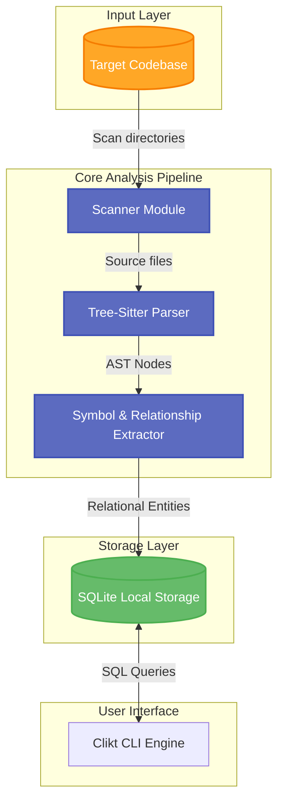

# 🚀 KIndex

<p align="center">
  
  
  
  
  
</p>

<p align="center">
  <strong>Understand any codebase in minutes, not days.</strong>
</p>

<p align="center">
  KIndex is a local-first, offline-ready developer tool that scans software projects, extracts syntactic symbols using concrete syntax trees, and builds a queryable knowledge graph stored directly in a SQLite database.
</p>

---

## 📖 Table of Contents

- [💡 Project Vision](#-project-vision)
- [🌟 Key Features](#-key-features)
- [🏗️ System Architecture](#️-system-architecture)
- [📦 Module Breakdown](#-module-breakdown)
- [🚀 Quick Start & Usage](#-quick-start--usage)
- [⚙️ Tech Stack](#️-tech-stack)
- [🗺️ Roadmap & Milestones](#️-roadmap--milestones)
- [🤝 Contributing](#-contributing)
- [📄 License](#-license)

---

## 💡 Project Vision

> [!NOTE]
> Navigating modern, complex repositories usually involves tedious manual clicks or heavy AI models that require internet connectivity and leak code privacy. 
> 
> **KIndex** solves this by performing fast, offline, and deterministic static analysis directly on your local machine. By translating syntax trees into clean relational entity-relationship models, it provides instant answers to structural code queries.

---

## 🌟 Key Features

*   **🔍 AST-Based Code Analysis** — Leverages Tree-sitter for lightning-fast, high-precision concrete syntax tree extraction.
*   **🌳 Symbol Graph Construction** — Automatically maps packages, files, classes, methods, fields, and imports.
*   **🔗 Relationship Mapping** — Traces dependencies, inheritance, method overrides, and cross-file usage patterns.
*   **💾 Local & SQLite-Powered** — Stores results in a single SQLite database file. Completely offline; your code never leaves your computer.
*   **💻 Interactive CLI Console** — Query symbols, find references, and view dependencies straight from your terminal.

---

## 🏗️ System Architecture



---

## 📦 Module Breakdown

The project is structured as a Gradle multi-module project for modularity and separation of concerns:

| Module | Purpose | Description |
| :--- | :--- | :--- |
| [**`kindex-core`**](file:///c:/Users/ajith/Videos/Projects/KIndex/kindex-core) | Core Engines | Defines domain models, shared interfaces, and indexing orchestrator. |
| [**`kindex-parser`**](file:///c:/Users/ajith/Videos/Projects/KIndex/kindex-parser) | Parsing Layer | Invokes Tree-sitter to build AST structures for Kotlin/Java sources. |
| [**`kindex-storage`**](file:///c:/Users/ajith/Videos/Projects/KIndex/kindex-storage) | Database & Schema | Handles the SQLite DB setup, migrations, and symbol persistence. |
| [**`kindex-cli`**](file:///c:/Users/ajith/Videos/Projects/KIndex/kindex-cli) | Terminal UX | Standard CLI utility powered by Clikt and Mordant for interactive output. |

---

## 🚀 Quick Start & Usage

### Prerequisites

- **Java Development Kit (JDK):** Version 17 or higher.
- **Git** (for scanning repositories).

### Build from Source

Clone the repository and compile the binaries:

```bash
# Clone the repository
git clone https://github.com/AjithGoveas/kindex.git
cd KIndex

# Compile and package modules
./gradlew build
```

### CLI Command Reference

Once built, you can run KIndex CLI using the Gradle run configuration or run the generated binary:

#### 1. Scan and Index a Repository
Index a target repository and generate the SQLite database.
```bash
./gradlew :kindex-cli:run --args="scan /path/to/target/project"
```

#### 2. Query Symbols (Planned)
Find where classes or functions are declared.
```bash
./gradlew :kindex-cli:run --args="query MyClassName"
```

---

## ⚙️ Tech Stack

- **Core Language:** [Kotlin 1.9.x](https://kotlinlang.org/)
- **Build System:** Gradle (Kotlin DSL)
- **CLI Framework:** [Clikt](https://ajalt.github.io/clikt/) (Multiplatform CLI library)
- **Terminal Styling:** [Mordant](https://ajalt.github.io/mordant/) (ANSI styling & rich colors)
- **AST Parsing Engine:** [Tree-sitter](https://tree-sitter.github.io/tree-sitter/)
- **Database Backend:** SQLite

---

## 🗺️ Roadmap & Milestones

### **Phase 1: Foundation (In Progress)**
- [x] Basic multi-module Gradle scaffolding
- [x] Clikt-based CLI entry point (`scan` command stub)
- [ ] Directory scanner with ignore rules (e.g., matching `.gitignore`)
- [ ] SQLite database setup and schema creation

### **Phase 2: Parsing & Indexing**
- [ ] Tree-sitter bindings integration
- [ ] Kotlin grammar support (class, method, and import extraction)
- [ ] Java grammar support
- [ ] Symbol-to-symbol reference graph generation

### **Phase 3: Search & UX**
- [ ] Fuzzy search queries on symbols (e.g., wildcard, camelCase, regex)
- [ ] Interactive text UI dashboard (TUI) for codebase navigation
- [ ] Support for JSON/Markdown exports of code dependency graphs

---

## 🤝 Contributing

Contributions are highly welcome! Please follow these guidelines:

1. **Fork** the repository and create your feature branch: `git checkout -b feature/amazing-feature`.
2. Ensure your changes compile perfectly and pass all unit tests: `./gradlew test`.
3. Open a **Pull Request** detailing the rationale behind your change.

---

## 📄 License

This project is currently under active development. License terms and documentation will be finalized prior to the first stable release.