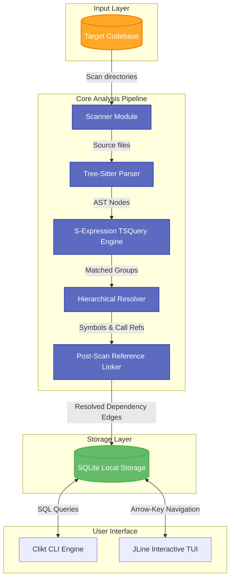

# 🚀 KIndex

<p align="center">
  
  
  
  
  
</p>

<p align="center">
  <strong>Understand any codebase in minutes, not days.</strong>
</p>

<p align="center">
  KIndex is an idiomatic, local-first <strong>Kotlin Multiplatform (KMP)</strong> developer tool that scans software projects, extracts syntactic symbols using native concrete syntax trees, and builds a queryable knowledge graph stored directly in a local SQLite database.
</p>

---

## 📖 Table of Contents

- [💡 Project Vision](#-project-vision)
- [🌟 Key Features](#-key-features)
- [🏗️ System Architecture](#-system-architecture)
- [📦 Module Breakdown](#-module-breakdown)
- [🚀 Quick Start & Usage](#-quick-start--usage)
- [⚙️ Tech Stack](#-tech-stack)
- [🗺️ Roadmap & Milestones](#-roadmap--milestones)
- [🤝 Contributing](#-contributing)
- [📄 License](#-license)

---

## 💡 Project Vision

> [!NOTE]
> Navigating modern, complex repositories usually involves tedious manual clicks or heavy AI models that require internet connectivity and leak code privacy. 
> 
> **KIndex** solves this by performing fast, offline, and deterministic static analysis directly on your local machine. By translating syntax trees into clean relational entity-relationship models, it provides instant answers to structural code queries.

---

## 🌟 Key Features

*   **🔍 AST-Based Code Analysis** — Leverages Tree-sitter for lightning-fast, high-precision concrete syntax tree extraction.
*   **🌐 S-Expression Query Engine** — Combines declarative native Tree-sitter queries (`TSQuery`) with parent match grouping for high-fidelity extraction.
*   **📐 Hierarchical Nesting Resolution** — Automatically resolves lexical member scopes (e.g. member functions inside classes) using byte-range bounding containment logic.
*   **🚀 Multi-Language Support** — Fully indexes **Java, Kotlin, Rust, C, C++, C#, JavaScript (JSX), TypeScript (TSX), Go, and CSS**.
*   **🔗 Reference & Call site Linking** — Extracts unresolved symbol method calls/class instantiations and resolves them post-scan to build a rich dependency graph.
*   **💾 Local & SQLite-Powered** — Stores results in a single SQLite database file managed by **SQLDelight** for type-safe, multiplatform database execution.
*   **💻 Interactive CLI & TUI Console** — Query symbols, check metrics, search for dead code, and navigate scopes straight from a rich terminal interface.

---

## 🏗️ System Architecture



---

## 📦 Module Breakdown

The project is structured as an idiomatic Gradle Kotlin Multiplatform (KMP) project:

| Module | Purpose | Description |
| :--- | :--- | :--- |
| [**`kindex-core`**](file:///c:/Users/ajith/Videos/Projects/KIndex/kindex-core) | Core Engines | Defines shared domain models, graph structures, and file interfaces. |
| [**`kindex-parser`**](file:///c:/Users/ajith/Videos/Projects/KIndex/kindex-parser) | Parsing Layer | Invokes S-expression query matches for all 8 grammar sets via JNI on JVM. |
| [**`kindex-storage`**](file:///c:/Users/ajith/Videos/Projects/KIndex/kindex-storage) | Database & Schema | Handles multiplatform SQLite persistence, migrations, and indexing via SQLDelight. |
| [**`kindex-cli`**](file:///c:/Users/ajith/Videos/Projects/KIndex/kindex-cli) | Terminal UX | Clikt commands and JLine arrow-key driven interactive dashboard. |

---

## 🚀 Quick Start & Usage

### Prerequisites

- **Java Development Kit (JDK):** Version 17 or higher.
- **Git** (for scanning repositories).

### Build from Source

Clone the repository and compile the binaries:

```bash
# Clone the repository
git clone https://github.com/AjithGoveas/kindex.git
cd KIndex

# Compile and package modules
./gradlew build :kindex-cli:installDist
```

### CLI Command Reference

Once built, you can run KIndex CLI using the generated distribution scripts:

#### 1. Scan and Index a Repository
Index a target repository and generate the SQLite database.
```bash
./kindex-cli/build/install/kindex-cli/bin/kindex-cli scan /path/to/target/project
```

#### 2. Query Symbols (SQLite FTS5 Tokenized Search)
Find where classes or functions are declared using SQLite FTS5 full-text search with camelCase and sub-word tokenization (e.g. searching `Resolver` matches `SymbolResolver`):
```bash
./kindex-cli/build/install/kindex-cli/bin/kindex-cli query "Resolver" /path/to/target/project
```

#### 3. Interactive TUI Dashboard
Explore codebase structure, search symbols, and list dead code with arrow keys:
```bash
./kindex-cli/build/install/kindex-cli/bin/kindex-cli interactive /path/to/target/project
```

#### 4. Git Hook Automation
Install, inspect, or remove non-blocking background re-scan hooks for Git lifecycle events (`post-commit`, `post-checkout`, `post-merge`, `post-rewrite`):
```bash
# Check status of Git hooks
./kindex-cli/build/install/kindex-cli/bin/kindex-cli hook status /path/to/target/project

# Install non-blocking background hooks
./kindex-cli/build/install/kindex-cli/bin/kindex-cli hook install /path/to/target/project

# Uninstall hooks
./kindex-cli/build/install/kindex-cli/bin/kindex-cli hook uninstall /path/to/target/project
```

#### 5. Multi-Format Graph Exporters
Export repository architectural dependencies to Mermaid, Graphviz DOT, or JSON:
```bash
# Export Mermaid diagram (.mmd)
./kindex-cli/build/install/kindex-cli/bin/kindex-cli export /path/to/target/project -f mermaid -o graph.mmd

# Export Graphviz DOT (.dot)
./kindex-cli/build/install/kindex-cli/bin/kindex-cli export /path/to/target/project -f dot -o graph.dot

# Export JSON Graph (.json)
./kindex-cli/build/install/kindex-cli/bin/kindex-cli export /path/to/target/project -f json -o graph.json
```

---

## ⚙️ Tech Stack

- **Core Language:** [Kotlin 2.x (Multiplatform)](https://kotlinlang.org/)
- **Build System:** Gradle (Kotlin DSL)
- **CLI Framework:** [Clikt](https://ajalt.github.io/clikt/) (Multiplatform CLI library)
- **Terminal Styling:** [Mordant](https://ajalt.github.io/mordant/) & [JLine](https://github.com/jline/jline3) (TUI rendering)
- **AST Parsing Engine:** [Tree-sitter](https://tree-sitter.github.io/tree-sitter/)
- **Database Backend:** SQLite via [SQLDelight](https://cashapp.github.io/sqldelight/)

---

## 🗺️ Roadmap & Milestones

### **Phase 1: Foundation (Completed)**
- [x] Multi-module Gradle Kotlin Multiplatform structure setup
- [x] Clikt-based CLI entry point
- [x] SQLDelight local database schema and multiplatform driver persistence

### **Phase 2: Parsing & Indexing (Completed)**
- [x] Tree-sitter bindings integration
- [x] Declarative S-expression (`TSQuery`) parser engine
- [x] Support for 8 major languages (Kotlin/Java, Rust, C/C++, C#, JS/TS, Go, CSS)
- [x] Lexical scope-containment and inheritance resolution
- [x] Post-Scan Reference Linker resolving call sites and instantiations

### **Phase 3: Interactive UX (Completed)**
- [x] Command-line querying, dead code tracing, and statistics commands
- [x] Rich Arrow-key driven TUI dashboard for interactive codebase traversal

---

## 🤝 Contributing

Contributions are highly welcome! Please follow these guidelines:

1. **Fork** the repository and create your feature branch: `git checkout -b feature/amazing-feature`.
2. Ensure your changes compile perfectly and pass all unit tests: `./gradlew test`.
3. Open a **Pull Request** detailing the rationale behind your change.

---

## 📄 License

This project is currently under active development. License terms and documentation will be finalized prior to the first stable release.