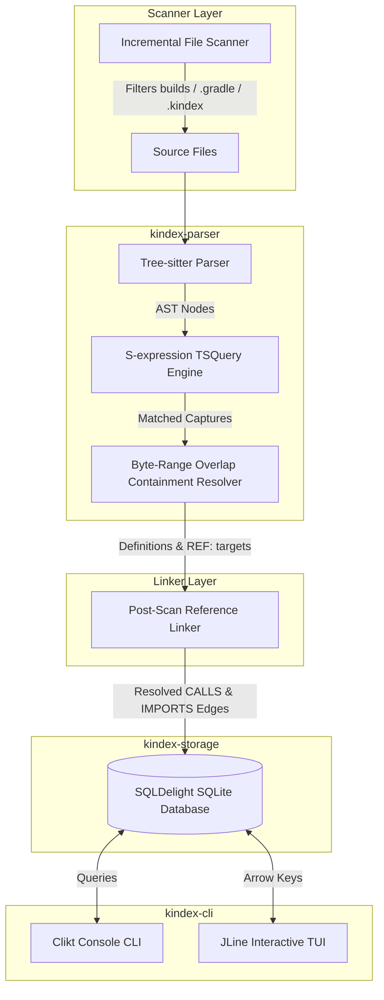

# Project Brief: KIndex – Code Knowledge Indexer

  <strong>Understand any codebase in minutes, not days.</strong>

---

> [!NOTE]
> **KIndex** is an offline-first, local-first developer tool that translates abstract syntax trees (ASTs) into queryable relational graph data. It operates entirely on your local machine, keeping code safe and private while providing instant architectural insights.

---

## 1. Project Overview

*   **Project Name:** KIndex (Code Knowledge Indexer)
*   **Vision:** Provide developers with instant, offline answers to structural code queries—such as tracing function callers, mapping class hierarchy structures, and finding unreachable code—without manual directory traversal.

---

## 2. Problem Statement

Modern software projects grow complex quickly. New contributors and technical architects waste hours:
1.  Mapping package organizations.
2.  Understanding parent-child lexical scopes (nested functions, traits, struct interfaces).
3.  Tracing cross-file references (knowing where a class is instantiated or a method is called).

While IDEs facilitate single-file navigation, they lack a unified database-queryable structure representing the overall repository graph.

---

## 3. Objectives

*   **Primary:** Parse codebase ASTs and store structural symbols and dependency relationships inside a local queryable database.
*   **Secondary:**
    *   Operational offline-first design.
    *   Extensible language-agnostic parsing layer.
    *   Incremental codebase scanning using file hashes.
    *   Rich CLI and keyboard-driven terminal dashboard.

---

## 4. Scope & Supported Languages

### Supported Programming Languages
KIndex indexes 8 major programming languages and formats out of the box:
*   **Kotlin & Java** (package hierarchies, class declarations, method calls, instantiations)
*   **Rust** (modules, traits, structs, impl blocks, function invocations)
*   **C & C++** (preprocessor include files, namespaces, function definitions, structs)
*   **C#** (using scopes, namespaces, classes, interfaces, method definitions)
*   **JavaScript & TypeScript** (imports, classes, interfaces, function and method invocations)
*   **Go** (packages, structs, interfaces, functions, methods)
*   **CSS** (class and ID selectors)

---

## 5. Functional Architecture & Components

---

## 6. Technical Specifications

### Multiplatform Storage Backend
*   **SQLDelight Engine:** Resolves persistence across targets. Maps files, symbols, and relationship tables cleanly with sqlite indexes to optimize graph queries.
*   **Performance Tuning:** Enforces WAL journal mode and normal synchronous pragmas to handle bulk codebase updates efficiently.

### S-Expression Code Parser
*   **Native tree-sitter queries:** Employs declarative query files (`.scm`) and syntax blocks mapping node identifiers positionally to maximize parsing throughput.
*   **Lexical Scoping:** Bounding containment resolve rules map member scopes (e.g. methods within struct/class ranges) to their parent.

### Reference Linker
*   Parses call targets as unresolved `REF:` targets.
*   Resolves calls against:
    *   Direct import declarations.
    *   Same-package declarations (sibling files).
    *   Local file declarations.
    *   Wildcard imports (e.g. `import package.*`).

---

## 7. Design Philosophy

> **Parse once. Build knowledge once. Query instantly.**

KIndex prioritizes deterministic code analysis over heuristics, generating code graphs directly from compiler syntax trees.