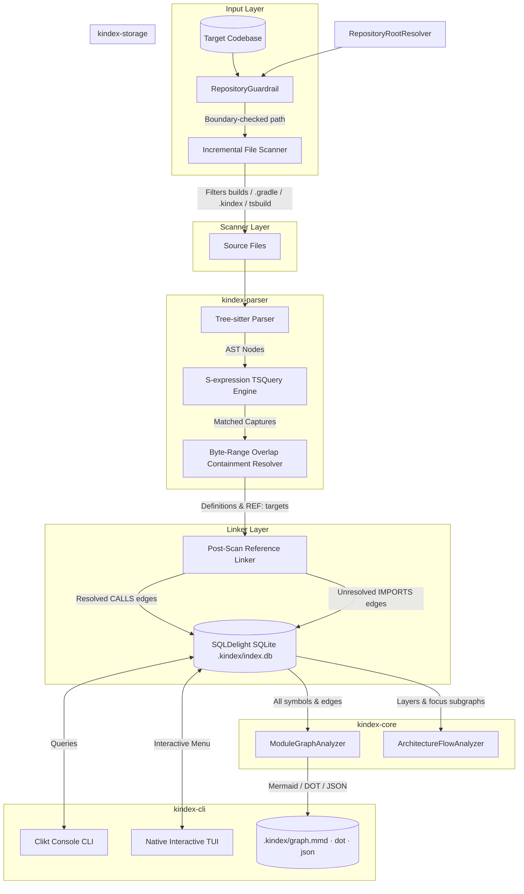

# Project Brief: KIndex – Code Knowledge Indexer v1.0.0

  <strong>Understand any codebase in minutes, not days.</strong>

---

> [!NOTE]
> **KIndex** is an offline-first, local-first developer tool that translates abstract syntax trees (ASTs) into queryable relational graph data. It operates entirely on your local machine, keeping code safe and private while providing instant architectural insights.
> 
> As of **v1.0.0**, KIndex ships as a **standalone Windows native executable** (`kindex.exe`) with zero JVM or runtime dependencies.

---

## 1. Project Overview

*   **Project Name:** KIndex (Code Knowledge Indexer)
*   **Current Version:** `v1.0.0`
*   **Vision:** Provide developers with instant, offline answers to structural code queries—such as tracing function callers, mapping class hierarchy structures, and finding unreachable code—without manual directory traversal.
*   **Distribution:** Standalone Windows executable (`kindex.exe`) via custom GitHub tag-based release uploads. macOS & Linux executables planned.

---

## 2. Problem Statement

Modern software projects grow complex quickly. New contributors and technical architects waste hours:
1.  Mapping package organizations.
2.  Understanding parent-child lexical scopes (nested functions, traits, struct interfaces).
3.  Tracing cross-file references (knowing where a class is instantiated or a method is called).

While IDEs facilitate single-file navigation, they lack a unified database-queryable structure representing the overall repository graph.

---

## 3. Objectives

*   **Primary:** Parse codebase ASTs and store structural symbols and dependency relationships inside a local queryable database.
*   **Secondary:**
    *   Operational offline-first design.
    *   Extensible language-agnostic parsing layer.
    *   Incremental codebase scanning using file hashes.
    *   Rich CLI and keyboard-driven terminal dashboard.
    *   **Strict local repository boundary enforcement** — the tool cannot read or scan files outside its host repository.
    *   **Zero-dependency standalone executable** for Windows distribution.

---

## 4. Scope & Supported Languages

### Supported Programming Languages
KIndex indexes 8 major programming languages and formats out of the box:
*   **Kotlin & Java** (package hierarchies, class declarations, method calls, instantiations)
*   **Rust** (modules, traits, structs, impl blocks, function invocations)
*   **C & C++** (preprocessor include files, namespaces, function definitions, structs)
*   **C#** (using scopes, namespaces, classes, interfaces, method definitions)
*   **JavaScript & TypeScript** (imports, classes, interfaces, function and method invocations)
*   **Go** (packages, structs, interfaces, functions, methods)
*   **CSS** (class and ID selectors)

---

## 5. Functional Architecture & Components

---

## 6. Technical Specifications

### Multiplatform Storage Backend
*   **SQLDelight Engine:** Resolves persistence across targets. Maps files, symbols, and relationship tables cleanly with SQLite indexes to optimize graph queries.
*   **Performance Tuning:** Enforces WAL journal mode and normal synchronous pragmas to handle bulk codebase updates efficiently.
*   **Native Driver:** Uses Touchlab's SQLiter `NativeSqliteDriver` with `ExistingDbSchema` delegation to open pre-existing databases without re-running `CREATE TABLE`.

### S-Expression Code Parser
*   **Native tree-sitter queries:** Employs declarative query files (`.scm`) and syntax blocks mapping node identifiers positionally to maximize parsing throughput.
*   **Lexical Scoping:** Bounding containment resolve rules map member scopes (e.g. methods within struct/class ranges) to their parent.

### Reference Linker
*   Parses call targets as unresolved `REF:` targets.
*   Resolves calls against:
    *   Direct import declarations.
    *   Same-package declarations (sibling files).
    *   Local file declarations.
    *   Wildcard imports (e.g. `import package.*`).
*   **External dependencies preserved:** imports that fail all resolution steps are no longer dropped — they are stored as `IMPORTS` edges referencing the external FQN, so `External Dependencies` nodes appear in every exported graph.
*   **Resolution cascade:** exact id → `.*` wildcard (package prefix) → top-level-function id (`pkg#name`) → package+name → file-name fallback.
*   Kotlin package/import captures are cleaned of the `package ` / `import ` keywords and trailing comments so ids resolve deterministically.

### Graph Analysis & Export
*   **`ModuleGraphAnalyzer`:** Central module-aware renderer generating Mermaid (`renderMermaid`), Graphviz DOT (`renderDot`), and JSON (`renderJson`). Output is grouped into per-module subgraphs (`kindex-cli`, `kindex-core`, `kindex-parser`, `kindex-storage`), styled by architectural layer, annotated for `actual` source-set implementations and `solo` (unused) files, with cross-module edges aggregated and labeled with call counts.
*   **Emitted by scan:** `.kindex/graph.{mmd,dot,json}` are written automatically at the end of every `kindex scan` (and the interactive scan), making the architecture diagram a first-class scan output.
*   **`ArchitectureFlowAnalyzer`:** Classifies layers path-based (`/cli/`, `/storage/`, `/parser/`, `/core/`), supports `-g flow|file|package|symbol` granularity, `-f mermaid|dot|json` formats, and `--focus` N-hop subgraph traversal.

### Security Guardrails
*   **`RepositoryRootResolver`:** Walks parent directories to locate the repository root (`.git` or `settings.gradle.kts`). Ensures `.kindex/` is always created at the top-level root.
*   **`RepositoryGuardrail`:** Canonicalizes all target paths and rejects any operation attempting to access paths outside the repository boundary.

### Native Compilation
*   **Kotlin/Native `mingwX64`:** Compiles `kindex.exe` as a standalone Windows binary via LLVM/lld.
*   **Compiler Flag:** `-Xexpect-actual-classes` applied globally across all KMP submodules to suppress Beta warnings on `expect`/`actual` class declarations.

---

## 7. Design Philosophy

> **Parse once. Build knowledge once. Query instantly.**

KIndex prioritizes deterministic code analysis over heuristics, generating code graphs directly from compiler syntax trees. The tool is **strictly local** — it never sends code, paths, or metadata to any external service.